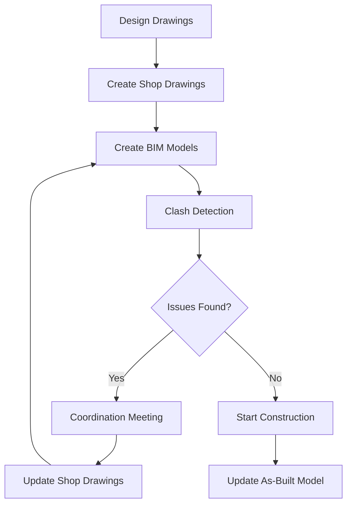

# Construction BIM Overview

Learn the overall picture of BIM utilized at Japanese construction sites.

!!! warning "Shop Drawing Understanding is Essential"
    BIM models are created based on shop drawings. Without understanding shop drawings, you cannot use BIM effectively.

## 🎯 What is Construction BIM?

**Construction BIM** is **"3D models of buildings used to improve construction quality and efficiency"**.

### Differences from Design BIM

| Item | Design BIM | Construction BIM |
|------|-----------|-----------------|
| **Purpose** | Design verification | Construction planning & clash detection |
| **Detail Level** | LOD 200-300 | LOD 300-400 |
| **Who Creates** | Architects, designers | General contractors, subcontractors |
| **Based On** | Design drawings | Shop drawings |
| **Key Usage** | Spatial verification, 3D visualization | Clash detection, constructability review |

!!! tip "Key Point"
    Construction BIM is based on **shop drawings**, not design drawings. If shop drawings are incorrect, BIM models will also be incorrect.

## 📊 BIM Workflow on Site

### Step-by-Step Explanation

#### Step 1: Create Shop Drawings
Based on design drawings, create detailed shop drawings.

**Person in charge**: General contractor (construction management), subcontractors

#### Step 2: Create BIM Models
Model shop drawings in 3D.

**Person in charge**: BIM operator (general contractor or subcontractor)

#### Step 3: Clash Detection
Check for interference between structure and MEP.

**Main checks**:
- Structure vs. MEP (ducts, pipes)
- Structure vs. structure
- MEP vs. MEP

#### Step 4: Coordination Meeting
Discuss countermeasures for detected clashes.

**Participants**: General contractor, structural contractor, MEP contractor

#### Step 5: Update Shop Drawings
Reflect modifications in shop drawings and BIM models.

#### Step 6: Start Construction
Begin construction after confirming no issues.

#### Step 7: As-Built Model
Update BIM model to reflect actual construction.

---

## 🏗️ Phase-by-Phase BIM Utilization

### Foundation Work Phase
- **Applications**: Foundation layout verification, rebar interference check
- **Effects**: Prevent rework, ensure quality

### Structural Work Phase
- **Applications**: Structure clash detection, sleeve checks
- **Effects**: Prevent post-concrete drilling, reduce rework

### MEP Work Phase
- **Applications**: MEP routing planning, ceiling height verification
- **Effects**: Optimize ceiling space, prevent conflicts

### Finishing Work Phase
- **Applications**: Fixture placement planning, coordination of multiple trades
- **Effects**: Prevent installation conflicts, smooth construction

---

## 📐 LOD (Level of Detail)

**LOD** indicates the level of detail in BIM models.

| LOD | Name | Content | Stage | Example |
|-----|------|---------|-------|---------|
| 100 | Conceptual | Simple massing | Concept design | Building volume only |
| 200 | Approximate | Approximate shape/size | Schematic design | Rough column positions |
| 300 | Precise | Detailed dimensions | Detailed design | Accurate column sizes |
| 350 | Coordinated | Clash-checked | Construction documents | Interference resolved |
| 400 | Fabrication | Fabrication details | Construction | Bolt hole positions |
| 500 | As-Built | As-built | Post-construction | Actual construction state |

!!! tip "Construction BIM is LOD 300-400"
    In construction stage, LOD 300-400 is typically used. LOD 500 is for facility management.

---

## 💡 Benefits of BIM

### 1. Clash Detection
Detect interference before construction.

**Effect**: Prevent rework → cost reduction, schedule adherence

### 2. Visualization
Visualize complex details in 3D.

**Effect**: Easier understanding for clients and workers

### 3. Coordination
Coordinate between multiple trades.

**Effect**: Smooth information sharing

### 4. Quantity Takeoff
Automatically calculate material quantities from models.

**Effect**: Reduce estimation time, prevent calculation errors

---

## ❌ What BIM Cannot Do

### 1. BIM Cannot Fix Incorrect Shop Drawings
If shop drawings are wrong, BIM models will also be wrong.

### 2. BIM is Not a Magic Tool
BIM is just a tool. Human skills (shop drawing reading, construction knowledge) are essential.

### 3. Detailed Modeling Takes Time
Modeling everything in detail is time-consuming. Model only what's necessary.

---

## 🎓 Instructor Notes

### Teaching Points
1. **Emphasize "Shop drawings come first, BIM comes later"**
   - BIM models are 3D representations of shop drawings
   - If shop drawings are wrong, BIM will be useless

2. **Start with clash detection**
   - Clash detection is the most effective BIM application
   - No need to force full BIM adoption

3. **Demonstrate actual cases**
   - Show examples of "problems detected by BIM"
   - Make benefits tangible

### Common Questions & Answers

**Q: Do we need to model everything in BIM?**

A: No. Start with complex areas (e.g., column-beam joints, ceiling spaces). Full modeling takes too much time.

**Q: Which BIM software should we use?**

A: Popular in Japan: Revit, ArchiCAD, Rebro. However, software is just a tool. Understanding shop drawings is more important.

**Q: Can shop drawings be created from BIM models?**

A: Yes, but shop drawings should be created first, then modeled in BIM. Creating shop drawings from BIM often leads to impractical details.

---

## 🔗 Next Steps

Learned the BIM overview? Choose your next step:

  <button onclick="location.href='../bim/recipes/'" class="md-button md-button--primary">
    Learn Practical Applications
  </button>
  <button onclick="location.href='../ng/'" class="md-button">
    Learn from Failure Cases
  </button>
  <button onclick="location.href='../glossary/'" class="md-button">
    Check BIM Terminology
  </button>

---

## 📚 References

- BIM Utilization Guidelines (Ministry of Land, Infrastructure, Transport and Tourism)
- Construction Industry BIM/CIM Utilization Cases
