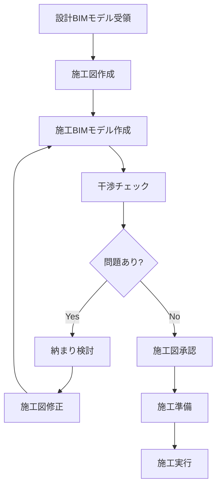

# 施工BIM全体像

## 🎯 この章で学ぶこと

- 日本の施工BIMとは何か
- 設計BIMと施工BIMの違い
- 工程別のBIM活用方法
- BIMのメリットとデメリット

## 🏗️ 施工BIMとは

**施工BIM** = 施工段階でBIMモデルを活用して、品質向上と効率化を図る取り組み

### 設計BIMとの違い

| 項目 | 設計BIM | 施工BIM |
|------|---------|---------|
| **目的** | デザイン検討、設計図作成 | 施工検討、干渉チェック |
| **精度** | 概略（LOD200-300） | 詳細（LOD300-400） |
| **情報** | 意匠・構造・設備の基本 | 納まり・取付詳細・施工手順 |
| **担当** | 設計者 | 施工者（元請・専門工事会社） |
| **成果物** | 設計図書、パース | 施工図、施工計画 |

!!! warning "重要な違い"
    設計BIMモデルをそのまま施工に使うことはできません。  
    **施工図の情報を追加・修正**して、施工BIMモデルを作成します。

## 📊 BIM活用の全体フロー

## 🔄 工程別BIM活用

### 1. 着工前段階
- 設計BIMモデルの確認
- 施工図作成方針の決定
- BIM実行計画（BEP）の策定

### 2. 施工図作成段階
- 施工図作成（2Dまたは3D）
- 施工BIMモデル作成
- 専門工事会社との調整

### 3. 施工準備段階
- **干渉チェック**（最重要！）
- 納まり検討
- 数量算出
- 施工計画の可視化

### 4. 施工段階
- 施工手順のシミュレーション
- 現場への情報提供（タブレット活用）
- 進捗管理
- 品質記録

### 5. 竣工・引渡段階
- 竣工BIMモデル作成
- 維持管理情報の引継ぎ

## 🎯 BIMの主な活用目的

### 1. 干渉チェック（Clash Detection）
**最も重要な活用方法**

- 躯体と設備の干渉
- 設備同士の干渉
- 仕上と設備の干渉

### 2. 納まり検討
- 複雑な部分の3D確認
- 取付順序の検討
- 施工可能性の確認

### 3. 施工計画
- 施工手順のシミュレーション
- 仮設計画の検討
- 安全対策の検討

### 4. 数量算出
- 材料数量の自動集計
- コスト管理
- 発注管理

### 5. 情報共有
- 関係者間での視覚的な情報共有
- 変更内容の迅速な伝達
- 施工記録の保存

## ✅ BIMのメリット

1. **手戻り削減**: 干渉を事前発見 → 現場での手直し減少
2. **品質向上**: 3D確認 → 納まり不具合の減少
3. **工期短縮**: 事前検討 → 施工の効率化
4. **コミュニケーション改善**: 視覚的 → 誤解の減少
5. **情報の一元管理**: 変更管理が容易

## ⚠️ BIMのデメリット・注意点

1. **初期投資**: ソフトウェア、教育にコストがかかる
2. **データ作成時間**: 施工図作成に加えてBIMモデル作成が必要
3. **スキルが必要**: 施工知識 + BIM操作の両方が必要
4. **データ管理**: 大容量ファイルの管理が必要
5. **施工図が前提**: 施工図の品質がBIMの品質を決める

!!! tip "成功のカギ"
    - 全工程でBIMを使う必要はありません
    - **効果の高い部分（干渉チェック）に集中**する
    - 小さく始めて、徐々に拡大する

## 📏 LOD（Level of Development）

BIMモデルの詳細度レベル：

| LOD | 名称 | 用途 | 施工段階 |
|-----|------|------|---------|
| 100 | 概念 | 基本計画 | - |
| 200 | 概略 | 基本設計 | - |
| 300 | 詳細 | 実施設計 | 施工図作成 |
| 350 | 調整済み | 施工図承認後 | **干渉チェック** |
| 400 | 施工 | 施工詳細 | 製作図 |
| 500 | 竣工 | 維持管理 | 引渡後 |

施工BIMでは通常 **LOD 300-400** を使用します。

## 🔗 次のステップ

  

    <h3>BIM活用レシピ</h3>
    
具体的な活用方法を実践的に学ぶ

  

  

    <h3>NG事例集</h3>
    
よくある失敗から学ぶ

  

  

    <h3>用語集</h3>
    
施工BIM用語を確認

  

---

## 💡 講師ノート

- 「BIMは魔法の道具ではない」ことを強調
- 施工図がベースであることを繰り返し説明
- 最初は干渉チェックだけでも大きな効果がある
- 無理に全部をBIM化する必要はない
- 効果測定（手戻り削減時間など）を記録させる
