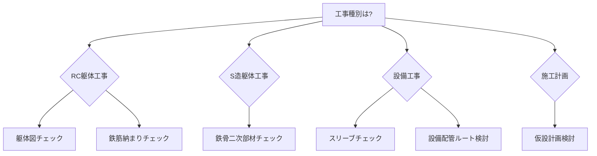

# BIM活用レシピ一覧

実務で使える施工BIM活用方法を「レシピ」形式でまとめています。

## 📋 レシピの使い方

各レシピには以下の情報が含まれています：

- **目的**: 何のために使うか
- **前提知識**: 必要な施工図の知識
- **手順**: 具体的な実施方法
- **講師ノート**: 教える際のポイント
- **NG事例**: やらないとどうなるか
- **小テスト**: 理解度確認

## 🏗️ 躯体工事のレシピ

### [躯体図チェック](structure-check.md)
BIMモデルを使った躯体図の干渉チェックと納まり確認

- **難易度**: ⭐⭐☆☆☆
- **所要時間**: 2-4時間/1フロア
- **効果**: 手戻り削減、品質向上

### [鉄筋納まりチェック](rebar-coordination.md)
BIMを使った鉄筋の干渉・納まり確認

- **難易度**: ⭐⭐⭐☆☆
- **所要時間**: 4-6時間/1フロア
- **効果**: 配筋手直し削減、かぶり厚さ確保

### [鉄骨二次部材チェック](steel-secondary.md)
鉄骨二次部材（母屋、胴縁、ブレース等）の取り合い・干渉確認

- **難易度**: ⭐⭐⭐☆☆
- **所要時間**: 8-12時間/1棟
- **効果**: 製作ミス削減、現場手戻り回避

## 🔧 設備工事のレシピ

### [スリーブチェック](sleeve-check.md)
躯体貫通孔（スリーブ）の位置・サイズ確認

- **難易度**: ⭐⭐☆☆☆
- **所要時間**: 3-5時間/1フロア
- **効果**: コア抜き削減、構造強度確保

### [設備配管ルート検討](mep-routing.md)
BIMを使った設備配管・ダクトの最適ルート計画

- **難易度**: ⭐⭐⭐⭐☆
- **所要時間**: 6-10時間/1フロア
- **効果**: 天井高さ確保、施工性向上

## 🏗️ 施工計画のレシピ

### [仮設計画検討](temp-planning.md)
BIMを使った仮設計画の可視化と安全性検証

- **難易度**: ⭐⭐⭐⭐☆
- **所要時間**: 12-20時間/1棟
- **効果**: 安全性向上、近隣説明の円滑化

## 📊 レシピ選択ガイド

## 🎯 推奨学習順序

### 初学者向け（まず3つ）
1. **[躯体図チェック](structure-check.md)** ← まずここから
2. **[スリーブチェック](sleeve-check.md)**
3. **[鉄筋納まりチェック](rebar-coordination.md)**

### 中級者向け（プラス2つ）
4. **[設備配管ルート検討](mep-routing.md)**
5. **[鉄骨二次部材チェック](steel-secondary.md)**

### 上級者向け（すべて）
6. **[仮設計画検討](temp-planning.md)**

## 💡 レシピ実践のコツ

1. **小さく始める**: 1フロアから始める
2. **繰り返す**: 何度も実施して慣れる
3. **記録する**: 効果を測定する
4. **共有する**: チームで知見を共有
5. **改善する**: 自社に合わせてカスタマイズ

---

  <a href="structure-check/" class="md-button md-button--primary">
    躯体図チェックから始める →
  </a>

