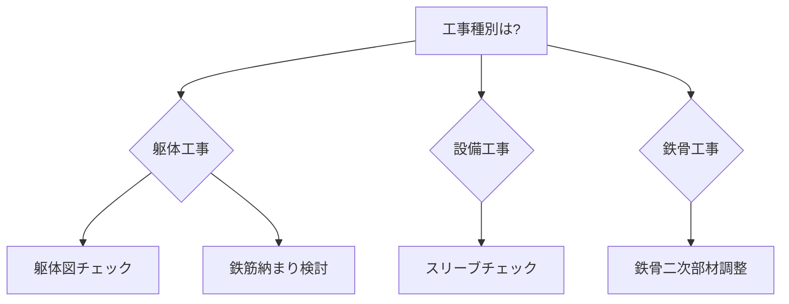

# BIM活用レシピ一覧

実務で使える施工BIM活用方法を「レシピ」形式でまとめています。

## 📋 レシピの使い方

各レシピには以下の情報が含まれています：

- **目的**: 何のために使うか
- **前提知識**: 必要な施工図の知識
- **手順**: 具体的な実施方法
- **講師ノート**: 教える際のポイント
- **NG事例**: やらないとどうなるか
- **小テスト**: 理解度確認

## 🏗️ 躯体工事のレシピ

### [躯体図チェック](structure-check.md)
BIMモデルを使った躯体図の干渉チェックと納まり確認

- **難易度**: ⭐⭐☆☆☆
- **所要時間**: 2-4時間/1フロア
- **効果**: 手戻り削減、品質向上

### [鉄筋納まり検討](rebar-coordination.md)
鉄筋の配置と納まりをBIMで詳細検討

- **難易度**: ⭐⭐⭐☆☆
- **所要時間**: 4-6時間/1フロア
- **効果**: 配筋ミス防止

## 🔧 設備工事のレシピ

### [スリーブチェック](sleeve-check.md)
躯体貫通孔（スリーブ）の位置・サイズ確認

- **難易度**: ⭐⭐☆☆☆
- **所要時間**: 3-5時間/1フロア
- **効果**: コア抜き削減、構造強度確保

## 🏭 鉄骨工事のレシピ

### [鉄骨二次部材調整](steel-secondary.md)
鉄骨二次部材（ブレース、母屋など）の取付確認

- **難易度**: ⭐⭐⭐☆☆
- **所要時間**: 2-3時間
- **効果**: 取付ミス防止

## 📊 レシピ選択ガイド

## 🎯 推奨学習順序

1. **[躯体図チェック](structure-check.md)** ← まずここから
2. **[スリーブチェック](sleeve-check.md)**
3. 鉄筋納まり検討
4. 鉄骨二次部材調整

## 💡 レシピ実践のコツ

1. **小さく始める**: 1フロアから始める
2. **繰り返す**: 何度も実施して慣れる
3. **記録する**: 効果を測定する
4. **共有する**: チームで知見を共有
5. **改善する**: 自社に合わせてカスタマイズ

---

  <a href="structure-check/" class="md-button md-button--primary">
    躯体図チェックから始める →
  </a>

