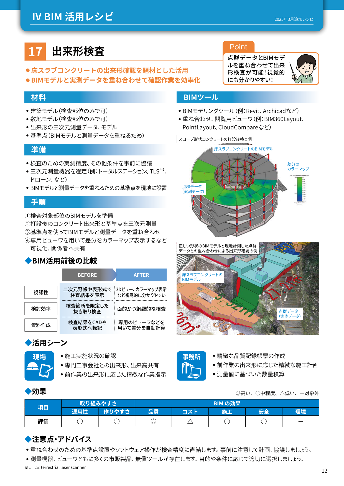

# 設備配管ルート検討 - BIM活用レシピ

## 📋 概要

BIMを使って設備配管・ダクトの最適ルートを計画し、躯体・他設備との干渉を回避

- **目的**: 設備配管・ダクトの効率的なルート計画、天井高さの確保、メンテナンス性向上
- **工程**: 実施設計後期～施工図作成段階
- **担当**: 元請（施工管理）+ 設備専門工事会社（空調・衛生・電気）
- **所要時間**: 1フロア 6-10時間

## 🔍 前提知識（施工図）

!!! warning "施工図が分からないと使えません"
    以下の施工図の知識が必須です：

- **設備図**: 配管・ダクト・配線の経路を示した図面（平面図・縦断図）
- **系統図**: 設備の接続関係を示した図（給排水系統、空調系統など）
- **天井伏図**: 天井の仕上げ高さ、点検口位置を示した図面
- **梁貫通図**: 配管・ダクトが梁を貫通する位置を示した図面
- **勾配**: 配管に必要な傾き（排水では重力で流すため必須）
- **配管サイズ**: 内径・外径、保温厚さを含む実寸法

## 📊 図解

  
  
図1: BIMモデルでの設備配管ルート計画（出典: 施工BIM資料①）

  
  
図2: 天井内の配管・ダクトの立体配置検討（出典: 施工BIM④）

## 👨‍🏫 講師が必ず言う5点

### 1️⃣ 工程
実施設計後期～施工図作成段階（躯体工事前にスリーブ位置を確定）

### 2️⃣ 誰の仕事
- **元請**: 全設備の統合調整、躯体との調整
- **空調設備会社**: ダクト・冷温水配管のルート計画
- **衛生設備会社**: 給排水配管のルート計画
- **電気設備会社**: 電気配線・ケーブルラックのルート計画

### 3️⃣ 何を決めるためか
- 各設備の最適ルート（最短距離、勾配確保）
- 躯体貫通位置（スリーブ位置）
- 天井懐の高さ確保（天井高さの決定）
- メンテナンススペースの確保

### 4️⃣ 施工図との関係
- **設備図**: 配管・ダクトの経路情報を取得
- **躯体図**: 梁・スラブとの干渉確認
- **天井伏図**: 天井高さとの整合確認
- **系統図**: 接続関係の確認

### 5️⃣ やらないと起きること
- 天井が下がりすぎて居室が狭く感じる
- 配管・ダクトが躯体に干渉して施工不可
- メンテナンススペース不足で点検困難
- 設備の性能低下（勾配不足による排水不良など）

## 🚀 実施手順

### ステップ1: 設備BIMモデルの作成

1. **優先順位の決定**
   - 大型ダクト > 配管 > 配線ラック の順に配置
   - サイズが大きく変更困難なものを優先

2. **ルート計画の基本**
   - 最短距離を基本とする
   - 勾配が必要な配管は確実に確保
   - 主要動線（廊下、階段）は避ける

### ステップ2: 干渉チェックと調整

**チェック項目**:

- ✅ 配管・ダクトと躯体の干渉
- ✅ 配管・ダクト同士の干渉
- ✅ 天井高さの確保（最低高さ確認）
- ✅ 勾配の確保（排水配管）
- ✅ メンテナンススペース確保
- ✅ 施工時の作業スペース

### ステップ3: ルート最適化

| 検討事項 | 確認内容 | 調整方法 |
|---------|---------|---------|
| 天井高さ | 設計の最低天井高さを満たすか | 配管・ダクトの高さ変更、ルート変更 |
| 勾配 | 排水配管の勾配は確保されているか | ルート変更、始点・終点の高さ調整 |
| クリアランス | 配管間隔は十分か（保温厚さ含む） | 配置順序の変更、ルート変更 |
| メンテナンス | 点検口から手が届くか | 点検口位置の変更、機器配置の変更 |

### ステップ4: スリーブ位置の確定

**スリーブリストの作成**:

1. **梁貫通スリーブ**
   - 位置（XY座標）、高さ（Z座標）
   - サイズ（直径または幅×高さ）
   - 構造補強の要否

2. **スラブ貫通スリーブ**
   - 位置、サイズ
   - 防火区画貫通の有無

3. **耐火被覆の要否**
   - 防火区画を貫通する場合は耐火措置が必要

## 💡 講師ノート

### 教え方のコツ
1. **「天井内は戦場」というイメージを持たせる**
   - ダクト、配管、配線、スプリンクラー、照明...すべてが天井内に集まる
   - 2D図面だけでは絶対に見えない干渉がある

2. **勾配の重要性を強調**
   - 排水配管は重力で流すため勾配が必須
   - 1/100（1mで1cm下がる）が基本だが、スペースが厳しいと確保が困難

3. **「設備は後から変更できない」ことを説明**
   - 配管・ダクトを設置した後の変更は莫大なコスト
   - BIMでの事前検討が重要

### よくある質問と回答例

**Q: すべての配管・ダクトをBIMでモデル化する必要がありますか？**

A: 主要なもの（大型ダクト、主管）を優先します。細かい枝管まですべてモデル化すると時間がかかりすぎます。

**Q: 配管とダクトが干渉した場合、どちらを優先しますか？**

A: 一般的には変更が困難な大型ダクトを優先しますが、排水配管の勾配確保が必要な場合は配管を優先することもあります。

**Q: 天井高さが確保できない場合はどうしますか？**

A: ①ルート変更 ②ダクト・配管のサイズ変更 ③局所的に天井を下げる（下がり天井） ④設計変更（梁せいを小さくする）などを検討します。

## ❓ 小テスト

### Q1: 設備配管ルート検討を実施する最適なタイミングは？

- [ ] A. 基本設計段階
- [x] B. 実施設計後期～施工図作成段階
- [ ] C. 躯体工事完了後
- [ ] D. 仕上げ工事開始前

**解説**: 実施設計後期～施工図作成段階が最適です。躯体工事前にスリーブ位置を確定する必要があります。

### Q2: 設備のルート計画で優先すべき順序は？

- [ ] A. 配線 > 配管 > ダクト
- [ ] B. 配管 > 配線 > ダクト
- [x] C. ダクト > 配管 > 配線
- [ ] D. すべて同時に計画

**解説**: サイズが大きく変更困難な大型ダクトを優先して配置します。

### Q3: 排水配管で必ず確保しなければならないものは？

- [ ] A. 最短距離
- [x] B. 勾配
- [ ] C. 水平配管
- [ ] D. 曲がり箇所

**解説**: 排水配管は重力で流すため、勾配（通常1/100以上）の確保が必須です。

### Q4: BIMで設備ルート検討する最大のメリットは？

- [ ] A. 図面作成時間の短縮
- [x] B. 天井内の3次元的な干渉を事前に発見
- [ ] C. 工事費の削減
- [ ] D. デザインの向上

**解説**: 天井内の複雑な干渉を3次元で可視化し、事前に発見・解決できることが最大のメリットです。

### Q5: スリーブ位置の確定が重要な理由は？

- [ ] A. 法律で義務付けられている
- [x] B. 躯体工事前に設置しないと後から開けるのは困難
- [ ] C. 見た目を良くするため
- [ ] D. 特に重要ではない

**解説**: スリーブは躯体コンクリート打設前に設置する必要があり、後から穴を開けるのは構造上・コスト上非常に困難です。

## 🔗 関連ページ

- [スリーブチェック](sleeve-check.md) - 躯体貫通孔の確認
- [鉄骨二次部材チェック](steel-secondary.md) - 鉄骨との取り合い
- [施工図の基礎](../../shop-drawing/index.md) - 設備図の読み方

## 📚 参考資料

- 建築設備設計基準（国土交通省）
- 建築工事標準仕様書（JASS 15 空気調和設備、JASS 16 給排水衛生設備）
- BIM活用ガイドライン（国土交通省）
