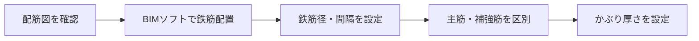

# 鉄筋納まりチェック - BIM活用レシピ

## 📋 概要

BIMを使って鉄筋の干渉・納まりを事前に確認し、配筋の施工性を向上させる

- **目的**: 鉄筋同士や鉄筋と構造部材の干渉を事前に検出、施工可能な配筋計画を確立
- **工程**: 配筋図作成後、実際の配筋施工前
- **担当**: 元請（施工管理）+ 鉄筋専門工事会社
- **所要時間**: 1フロア 4-6時間

## 🔍 前提知識（施工図）

!!! warning "施工図が分からないと使えません"
    以下の施工図の知識が必須です：

- **配筋図**: 鉄筋の配置・径・間隔を示した図面
- **鉄筋の種類**: 主筋、せん断補強筋（スターラップ、帯筋）、あばら筋、スパイラル筋
- **かぶり厚さ**: コンクリート表面から鉄筋までの距離（耐火・耐久性に影響）
- **定着長さ**: 鉄筋をコンクリートに定着させるために必要な長さ
- **継手**: 鉄筋を接続する方法（重ね継手、ガス圧接、機械式継手）
- **配筋納まり**: 複数の鉄筋が交差・重なる部分の配置可能性

## 📊 図解

  
  
図1: BIMモデルでの鉄筋干渉チェック（出典: 施工BIM資料①）

## 👨‍🏫 講師が必ず言う5点

### 1️⃣ 工程
配筋図承認後、実際の鉄筋組立前に完了（配筋前に修正が必須）

### 2️⃣ 誰の仕事
- **元請**: 干渉チェックの実施、調整会議の開催
- **鉄筋専門工事会社**: 納まり検討、施工可能性の判断
- **構造設計**: 重大な干渉の場合、設計変更の検討

### 3️⃣ 何を決めるためか
- 鉄筋同士の干渉の有無
- かぶり厚さの確保
- 施工可能な配筋順序
- 継手位置の調整

### 4️⃣ 施工図との関係
- **配筋図**: 鉄筋の配置・径・間隔の情報を取得
- **躯体図**: 構造部材との関係を確認
- **鉄筋加工図**: 実際の加工・組立手順を反映

### 5️⃣ やらないと起きること
- 現場で鉄筋が入らない（納まらない）
- かぶり厚さ不足による耐火性能低下
- 配筋手直しによる大幅な工程遅延
- 施工品質の低下（鉄筋間隔の不均一）

## 🚀 実施手順

### ステップ1: 鉄筋モデルの作成

1. **配筋図の情報を読み取る**
   - 主筋の位置・本数・径
   - スターラップの間隔・径
   - 継手位置・長さ

2. **BIMモデルに鉄筋を配置**
   - 柱・梁・スラブごとに配筋
   - かぶり厚さを正確に設定

### ステップ2: 干渉チェックの実行

**チェック項目**:

- ✅ 鉄筋同士の干渉（主筋とスターラップ、柱と梁の交差部）
- ✅ かぶり厚さの確保（最小値以上か）
- ✅ 配筋密度（鉄筋が詰まりすぎていないか）
- ✅ 定着長さの確保
- ✅ 継手の位置（同一断面に集中していないか）

### ステップ3: 問題の分類と対策

| 干渉レベル | 状況 | 対策 |
|----------|------|------|
| 🔴 重大 | かぶり不足、鉄筋が物理的に配置不可 | 設計変更を検討（鉄筋径変更、配置変更） |
| 🟡 中程度 | 施工が困難、品質に影響の可能性 | 配筋順序の変更、継手位置の調整 |
| 🟢 軽微 | 施工可能だが注意が必要 | 施工時の注意事項として記録 |

### ステップ4: 調整会議の実施

- **参加者**: 元請、鉄筋工事会社、構造設計（必要に応じて）
- **議題**: 干渉箇所の対策、配筋変更の承認
- **成果物**: 修正配筋図、施工要領書

## 💡 講師ノート

### 教え方のコツ
1. **「鉄筋は3次元で考える」ことを強調**
   - 2D図面だけでは見えない干渉がBIMで見える
   - 柱と梁の交差部が最も複雑になることを説明

2. **かぶり厚さの重要性を繰り返す**
   - 耐火性能、耐久性に直結
   - 数ミリの違いが問題になることを事例で示す

3. **実際の配筋写真と比較**
   - BIMモデルと現場の配筋写真を並べて見せる
   - 「BIMで事前に確認できていれば...」という視点

### よくある質問と回答例

**Q: すべての鉄筋をBIMでモデル化する必要がありますか？**

A: いいえ。まずは複雑な部分（柱梁接合部、スラブ開口部周辺）から始めましょう。全部をモデル化すると時間がかかりすぎます。

**Q: 干渉が検出されたら必ず設計変更が必要ですか？**

A: いいえ。多くの場合、配筋順序の変更や継手位置の調整で解決できます。設計変更が必要なのは、かぶり不足など構造安全性に関わる場合だけです。

**Q: 鉄筋のBIMモデル作成は誰がやりますか？**

A: 通常は元請のBIMオペレーターですが、鉄筋専門工事会社が自社でモデル化する場合もあります。配筋図を正確に読めることが前提です。

## ❓ 小テスト

### Q1: 鉄筋納まりチェックで最も優先してチェックすべき項目は？

- [ ] A. 鉄筋の重量
- [x] B. かぶり厚さの確保
- [ ] C. 鉄筋の色
- [ ] D. 鉄筋の価格

**解説**: かぶり厚さは耐火性能・耐久性に直結する最重要項目です。

### Q2: 鉄筋が最も複雑に干渉する箇所は？

- [ ] A. スラブ中央部
- [x] B. 柱と梁の接合部
- [ ] C. 外壁部分
- [ ] D. 階段部分

**解説**: 柱と梁の接合部は複数方向の鉄筋が交差するため、最も複雑になります。

### Q3: 鉄筋干渉が見つかった場合、最初に検討すべき対策は？

- [ ] A. すぐに設計変更を依頼
- [x] B. 配筋順序や継手位置の調整
- [ ] C. 工事を中止
- [ ] D. 鉄筋を削る

**解説**: 多くの場合、配筋順序や継手位置の調整で解決できます。設計変更は最終手段です。

### Q4: かぶり厚さが不足するとどうなる？

- [x] A. 耐火性能が低下する
- [ ] B. 見た目が悪くなる
- [ ] C. 工事費が高くなる
- [ ] D. 特に問題ない

**解説**: かぶり厚さ不足は耐火性能・耐久性の低下を招き、建築基準法違反となる場合もあります。

### Q5: 鉄筋BIMモデル作成の範囲として適切なのは？

- [ ] A. すべての鉄筋を詳細にモデル化
- [x] B. 複雑な部分を優先的にモデル化
- [ ] C. 鉄筋は一切モデル化しない
- [ ] D. 主筋だけをモデル化

**解説**: 時間対効果を考え、柱梁接合部など複雑な部分を優先してモデル化します。

## 🔗 関連ページ

- [躯体図チェック](structure-check.md) - 構造部材の干渉チェック
- [スリーブチェック](sleeve-check.md) - 設備貫通孔の確認
- [施工図の基礎](../../shop-drawing/index.md) - 施工図の読み方

## 📚 参考資料

- 鉄筋コンクリート造配筋指針（日本建築学会）
- 建築工事標準仕様書（JASS 5 鉄筋コンクリート工事）
- BIM活用ガイドライン（国土交通省）
