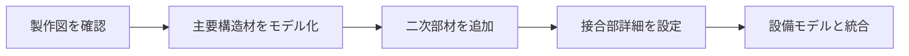

# 鉄骨二次部材チェック - BIM活用レシピ

## 📋 概要

BIMを使って鉄骨二次部材（母屋、胴縁、ブレース等）の取り合い・干渉を事前確認

- **目的**: 主要構造材と二次部材、設備との干渉を事前検出し、施工性を向上
- **工程**: 鉄骨製作図作成後、製作・建方前
- **担当**: 元請（施工管理）+ 鉄骨専門工事会社 + 設備専門工事会社
- **所要時間**: 1棟 8-12時間

## 🔍 前提知識（施工図）

!!! warning "施工図が分からないと使えません"
    以下の施工図の知識が必須です：

- **鉄骨製作図**: 鉄骨部材の詳細寸法・接合部を示した図面
- **主要構造材**: 柱、大梁、小梁など建物の主要な構造を支える部材
- **二次部材**: 母屋、胴縁、ブレース、階段など主要構造材に取り付く部材
- **接合部詳細**: ボルト、溶接などの接合方法と寸法
- **クリアランス**: 部材間に必要な最小間隔（施工・点検のため）
- **建方順序**: 鉄骨を建てる順番（主要構造材→二次部材の順）

## 📊 図解

  
  
図1: BIMモデルでの鉄骨二次部材干渉チェック（出典: 施工BIM資料①）

## 👨‍🏫 講師が必ず言う5点

### 1️⃣ 工程
鉄骨製作図承認後、製作開始前に完了（製作後の修正は非常に困難）

### 2️⃣ 誰の仕事
- **元請**: 干渉チェックの実施、関係者間の調整
- **鉄骨専門工事会社**: 取り合い詳細の検討、製作可能性の判断
- **設備専門工事会社**: ダクト・配管との干渉確認

### 3️⃣ 何を決めるためか
- 二次部材と主要構造材の取り合い
- 二次部材と設備（ダクト・配管）の干渉回避
- 接合部のクリアランス確保
- 建方順序の最終確認

### 4️⃣ 施工図との関係
- **鉄骨製作図**: 部材寸法・接合部の詳細情報を取得
- **設備図**: ダクト・配管ルートとの照合
- **建方計画図**: 建方順序との整合確認

### 5️⃣ やらないと起きること
- 現場で部材が干渉して取り付け不可
- 製作済み部材の作り直し（莫大なコスト増）
- 設備ルートの大幅変更
- 建方工程の大幅遅延

## 🚀 実施手順

### ステップ1: 鉄骨BIMモデルの作成

1. **主要構造材のモデル化**
   - 柱、大梁、小梁を配置
   - 部材寸法を正確に設定

2. **二次部材の追加**
   - 母屋、胴縁、ブレースを配置
   - 接合部の詳細（ボルト穴、溶接位置）を表現

3. **設備モデルとの統合**
   - ダクト、配管、電気配線ラックを重ね合わせ

### ステップ2: 干渉チェックの実行

**チェック項目**:

- ✅ 二次部材と主要構造材の取り合い（接合部の納まり）
- ✅ 二次部材同士の干渉（ブレースと母屋など）
- ✅ 二次部材と設備の干渉（母屋とダクトなど）
- ✅ クリアランスの確保（ボルト締めスペース、点検スペース）
- ✅ 建方時の仮設材との干渉

### ステップ3: 問題の分類と対策

| 干渉レベル | 状況 | 対策 |
|----------|------|------|
| 🔴 重大 | 部材が物理的に干渉、取り付け不可 | 部材位置変更、設計変更を検討 |
| 🟡 中程度 | クリアランス不足、施工困難 | 取り付け順序変更、部材寸法微調整 |
| 🟢 軽微 | 施工可能だが注意が必要 | 施工時の注意事項として記録 |

### ステップ4: 製作図への反映

**修正内容の記録**:

1. **取り合い詳細の修正**
   - 接合部の位置変更
   - ボルト穴位置の調整

2. **部材寸法の微調整**
   - 長さ、幅の変更（数ミリ単位）
   - 切り欠き、孔の追加

3. **製作指示書の更新**
   - 特記事項の追加
   - 施工注意点の明記

## 💡 講師ノート

### 教え方のコツ
1. **「主要構造材と二次部材は役割が違う」ことを明確に**
   - 主要構造材: 建物を支える（構造計算対象）
   - 二次部材: 屋根・壁を支える、補強など（構造計算外も多い）

2. **製作後の修正は極めて困難と強調**
   - 鉄骨は工場で製作するため、現場で切ったり溶接は困難
   - 「BIMで事前チェックしないと数百万円の損失」と具体例を示す

3. **実際の干渉写真を使う**
   - 母屋とダクトが干渉した事例
   - ブレースと配管が干渉した事例

### よくある質問と回答例

**Q: 二次部材は主要構造材ほど重要ではないのでは？**

A: 構造的には主要構造材が優先ですが、二次部材の不具合も工期・コストに大きく影響します。特に製作後の修正は非常にコストがかかります。

**Q: すべての二次部材をBIMでモデル化する必要がありますか？**

A: すべてが理想ですが、時間がない場合は複雑な部分（多くの部材が交差する箇所）を優先します。

**Q: 設備との干渉はどちらが優先ですか？**

A: 一般的には鉄骨が優先ですが、ダクトのルート変更が困難な場合もあります。設備担当者と協議して決定します。

## ❓ 小テスト

### Q1: 鉄骨二次部材チェックを実施する最適なタイミングは？

- [ ] A. 設計段階
- [x] B. 製作図承認後、製作開始前
- [ ] C. 製作完了後
- [ ] D. 建方完了後

**解説**: 製作図承認後、製作開始前が最適です。製作後の修正は非常にコストがかかります。

### Q2: 主要構造材に該当しないものは？

- [ ] A. 柱
- [ ] B. 大梁
- [x] C. 母屋
- [ ] D. 小梁

**解説**: 母屋は屋根を支える二次部材です。柱・大梁・小梁は主要構造材です。

### Q3: 鉄骨二次部材で最も干渉が多い相手は？

- [ ] A. 主要構造材だけ
- [ ] B. 他の二次部材だけ
- [x] C. 設備（ダクト・配管）
- [ ] D. 仕上げ材

**解説**: 二次部材は設備（特にダクト）と高さが近く、干渉が最も多く発生します。

### Q4: クリアランスが必要な理由として正しくないものは？

- [ ] A. ボルトを締めるスペース確保
- [ ] B. 点検スペースの確保
- [x] C. 見た目を良くするため
- [ ] D. 施工時の作業スペース確保

**解説**: クリアランスは施工・点検のために必要で、見た目のためではありません。

### Q5: 製作後の鉄骨部材修正が困難な理由は？

- [x] A. 工場で精密に製作済みで、現場での加工が難しい
- [ ] B. 鉄骨は切断できない
- [ ] C. 法律で禁止されている
- [ ] D. 特に困難ではない

**解説**: 鉄骨は工場で精密に製作されており、現場での切断・溶接は品質管理が難しく、コストも高くなります。

## 🔗 関連ページ

- [躯体図チェック](structure-check.md) - RC造の構造チェック
- [鉄筋納まりチェック](rebar-coordination.md) - 鉄筋の干渉確認
- [設備配管ルート検討](mep-routing.md) - 設備ルート計画

## 📚 参考資料

- 鋼構造製作技術指針（日本建築学会）
- 建築工事標準仕様書（JASS 6 鉄骨工事）
- BIM活用ガイドライン（国土交通省）
