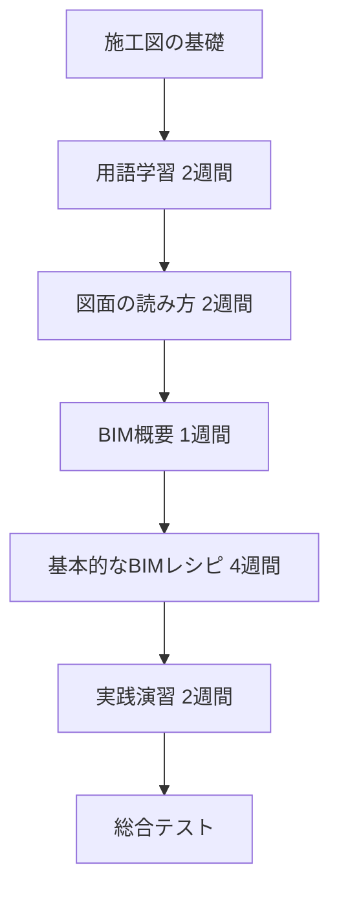
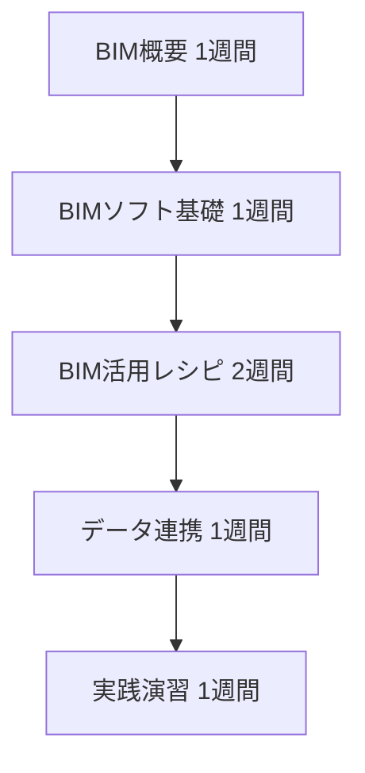
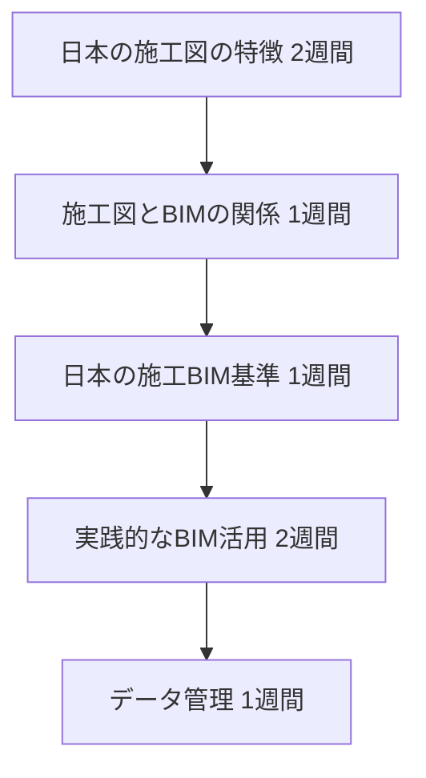

# 学習パス - 施工BIMの学び方

## 🎯 学習目標

このサイトで学ぶことで、以下ができるようになります：

- ✅ 日本の施工図を理解し、読み書きができる
- ✅ 施工図の情報をBIMモデルに反映できる
- ✅ BIMを使った干渉チェックと納まり検討ができる
- ✅ 施工BIMの各工程での活用方法を理解できる
- ✅ 現場でBIMを活用した業務改善ができる

## 📊 学習時間の目安

| ルート | 前提知識 | 学習時間 | 到達レベル |
|--------|---------|---------|-----------|
| **初学者** | なし | 8-12週間 | 基礎的なBIM活用ができる |
| **施工管理者** | 施工図の知識あり | 4-6週間 | 実務でBIMを活用できる |
| **BIMオペレーター** | BIMソフト操作可能 | 6-8週間 | 日本の施工BIMに対応できる |

## 🛤️ 3つの学習ルート

### 1. 初学者ルート 🌱

**対象者**: 施工図もBIMも初めての方

**学習フロー**:

**詳細カリキュラム**:

| 週 | テーマ | 内容 | 小テスト |
|----|-------|------|---------|
| 1-2 | 施工図基礎 | 用語、記号、図面の種類 | ✓ |
| 3-4 | 図面の読み方 | 平面図、断面図、矩計図 | ✓ |
| 5 | BIM概要 | 施工BIMとは、工程別活用 | ✓ |
| 6-7 | 躯体BIM | 躯体図チェック、干渉確認 | ✓ |
| 8-9 | 設備BIM | スリーブチェック、ルート検討 | ✓ |
| 10-11 | 実践演習 | 実際のプロジェクトでの適用 | - |
| 12 | 総合テスト | 理解度の最終確認 | ✓ |

### 2. 施工管理者ルート 👷

**対象者**: 施工図は分かるがBIMは初めての方

**学習フロー**:

**詳細カリキュラム**:

| 週 | テーマ | 内容 | 重点項目 |
|----|-------|------|---------|
| 1 | BIM概要 | 施工BIMの全体像、工程別活用 | データフローの理解 |
| 2 | BIMソフト基礎 | モデル作成、表示、チェック | 操作の習得 |
| 3-4 | BIM活用レシピ | 躯体、設備、仕上の各レシピ | 実務への適用 |
| 5 | データ連携 | 受領、変換、受け渡し | 品質管理 |
| 6 | 実践演習 | 自社プロジェクトでの適用 | 業務改善 |

### 3. BIMオペレータールート 💻

**対象者**: BIMソフトは使えるが日本の施工図に不慣れな方

**学習フロー**:

**詳細カリキュラム**:

| 週 | テーマ | 内容 | 重点項目 |
|----|-------|------|---------|
| 1-2 | 日本の施工図 | 日本特有の表現、納まりの考え方 | 文化的背景の理解 |
| 3 | 施工図とBIM | モデル作成時の注意点 | 精度管理 |
| 4 | BIM基準 | 日建連BIM基準、LOD定義 | 品質基準 |
| 5-6 | BIM活用 | 各工程での実践的な活用 | 業務フロー |
| 7-8 | データ管理 | ファイル命名、バージョン管理 | 品質保証 |

## 📚 推奨学習順序

### ステップ1: 基礎固め
1. [施工図の基礎](../shop-drawing/index.md)

### ステップ2: BIM概要
1. [施工BIM全体像](../bim/overview.md)

### ステップ3: 実践レシピ
1. [躯体図チェック](../bim/recipes/structure-check.md)
2. [スリーブチェック](../bim/recipes/sleeve-check.md)

### ステップ4: 応用
1. [NG事例集](../ng/index.md)で失敗事例を学ぶ
2. 実際のプロジェクトで適用
3. 講師のフィードバックを受ける

## ✅ チェックポイント

各ステップで以下を確認してください：

### 施工図基礎の理解度チェック
- [ ] 通り芯、GL、FLの意味が分かる
- [ ] 平面図、断面図、矩計図を読める
- [ ] 躯体、仕上、納まりの概念が分かる
- [ ] 干渉とは何か説明できる
- [ ] 施工図の役割を理解している

### BIM基礎の理解度チェック
- [ ] 施工BIMと設計BIMの違いが分かる
- [ ] LOD（詳細度）の概念が分かる
- [ ] 各工程でのBIM活用目的が分かる
- [ ] 干渉チェックの手順が分かる
- [ ] データ連携の重要性が分かる

### 実践力のチェック
- [ ] BIMモデルから施工図情報を読み取れる
- [ ] 干渉箇所を発見し、対策を提案できる
- [ ] 納まり検討ができる
- [ ] BIMデータの品質をチェックできる
- [ ] 他部署とBIMデータを連携できる

## 💡 学習のコツ

### 1. 施工図を先に理解する
BIMは道具に過ぎません。施工図の理解が最優先です。

### 2. 必ず手を動かす
読むだけでなく、実際にBIMソフトを操作してください。

### 3. NG事例から学ぶ
失敗事例を知ることで、同じミスを避けられます。

### 4. 用語を正確に覚える
日本の建設業界では用語が非常に重要です。

### 5. 小テストで確認
各レッスン後に必ず小テストで理解度を確認してください。

## 📝 学習記録

進捗を記録することで、モチベーションを維持できます：

| 完了日 | レッスン | 小テスト結果 | メモ |
|--------|---------|------------|------|
| 2025-01-05 | 施工図用語集 | 90% | 通り芯の理解が深まった |
| 2025-01-12 | 躯体図チェック | 80% | 干渉の見つけ方を復習 |
| ... | ... | ... | ... |

## 🎓 修了後のステップ

このサイトでの学習を修了したら：

1. **実プロジェクトでの適用**
   - 学んだレシピを実務で使う
   - 改善点をフィードバック

2. **継続的な学習**
   - 最新のBIM動向をキャッチアップ
   - 新しいソフトウェアの習得

3. **後輩の指導**
   - 学んだことを他の人に教える
   - 講師として活動する

---

  <a href="../../shop-drawing/" class="md-button md-button--primary">
    まずは施工図の基礎から始める →
  </a>

