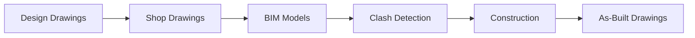

# Construction BIM Learning Platform

  <h3>⚠️ Important Prerequisite</h3>
  
Japanese Construction BIM <strong>"cannot be used without understanding shop drawings"</strong>.

  
This site teaches BIM application methods based on the understanding of shop drawings.

## 🎯 About This Site

This site is an **educational material site for instructors teaching Japanese Construction BIM to foreigners**.

### Features

- ✅ Learn step-by-step from shop drawing basics
- ✅ Practical BIM application recipes
- ✅ Rich illustrations and instructor notes
- ✅ Japanese/English support (Myanmar language support planned)
- ✅ Quizzes to confirm understanding

## 📚 Learning Routes

Choose a learning route that suits your position.

  

    
🌱

    <h3>Beginner Route</h3>
    
For those new to both shop drawings and BIM

    
<strong>Duration:</strong> 8-12 weeks

  

  

    
👷

    <h3>Construction Manager Route</h3>
    
For those who understand shop drawings but are new to BIM

    
<strong>Duration:</strong> 4-6 weeks

  

  

    
💻

    <h3>BIM Operator Route</h3>
    
For those who can use BIM software but are unfamiliar with Japanese shop drawings

    
<strong>Duration:</strong> 6-8 weeks

  

## 🏗️ What is Japanese Construction BIM?

At Japanese construction sites, BIM is utilized in the following flow:

### Key Points

1. **Shop drawings come first** - BIM models are based on shop drawings
2. **Used for clash detection** - Check interference between structure and MEP
3. **Practical use** - Not just 3D visualization, but problem-solving tools
4. **Continuous updates** - Models must be updated as construction changes

## 📖 Main Contents

### 1. [Shop Drawing Basics](shop-drawing/)
Learn the foundation - how to read and understand shop drawings.

- Terminology (50 essential terms)
- How to read drawings
- Types of shop drawings

### 2. [Construction BIM Overview](bim/overview/)
Understand the overall picture of Japanese Construction BIM.

- BIM workflow
- Phase-by-phase utilization
- LOD (Level of Detail)

### 3. [BIM Recipes](bim/recipes/)
Learn practical BIM application methods.

- Structure check
- Sleeve check
- Rebar coordination
- Steel secondary members check
- MEP routing planning
- Temporary planning

### 4. [Failure Cases](ng/)
Learn from actual failures.

- Common mistakes (10 cases)
- Cost impacts
- Prevention measures

## 🎓 For Instructors

This site provides materials to support instruction:

- **5-Point Checklist**: Points to emphasize when teaching
- **Instructor Notes**: Teaching tips and common questions
- **Quiz Questions**: Materials for understanding confirmation
- **Failure Cases**: Real examples for warnings

## 🌍 Multilingual Support

- 🇯🇵 Japanese (Current)
- 🇬🇧 English (Available)
- 🇲🇲 Myanmar (Planned)

---

  <h3>Ready to start learning?</h3>
  
<a href="guide/learning-path/" class="md-button md-button--primary">Choose Your Learning Path →</a>

