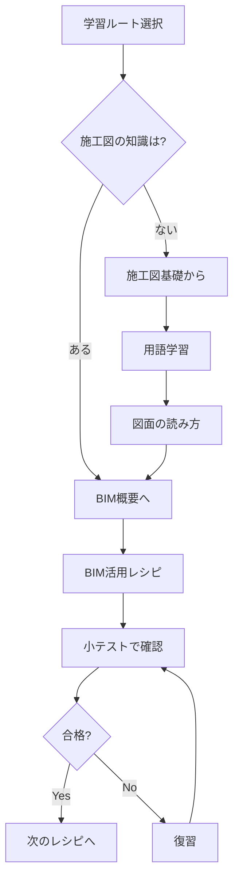

# 施工BIM教材サイト

  <h3>⚠️ 重要な前提条件</h3>
  
日本の施工BIMは<strong>「施工図が分からないと使えない」</strong>技術です。

  
このサイトでは、施工図の理解を前提として、BIMの活用方法を学びます。

## 🎯 このサイトについて

このサイトは、**外国人向けに日本の施工BIMを教える講師のための教材サイト**です。

### 特徴

- ✅ 施工図の基礎から段階的に学べる
- ✅ 実務に即したBIM活用レシピ
- ✅ 図解と講師ノートが充実
- ✅ 日本語・英語対応（ミャンマー語は今後対応予定）
- ✅ 小テストで理解度確認

## 📚 学習ルート

あなたの立場に合わせた学習ルートを選んでください。

  

    
🌱

    <h3>初学者ルート</h3>
    
施工図もBIMも初めての方向け

    
<strong>期間:</strong> 8-12週間

  

  

    
👷

    <h3>施工管理者ルート</h3>
    
施工図は分かるがBIMは初めての方向け

    
<strong>期間:</strong> 4-6週間

  

  

    
💻

    <h3>BIMオペレータールート</h3>
    
BIMソフトは使えるが日本の施工図に不慣れな方向け

    
<strong>期間:</strong> 6-8週間

  

## 🏗️ 日本の施工BIMとは

日本の建設現場では、以下の流れでBIMを活用します：

!!! warning "重要なポイント"
    - 設計図だけではBIMモデルは作れません
    - **施工図の情報**がBIMモデルの基盤になります
    - 施工図を理解していないと、BIMモデルの意味が分かりません

## 📖 主要コンテンツ

### 1. [施工図の基礎](shop-drawing/index.md)
施工BIMを学ぶ前に必ず理解が必要な施工図の基礎知識

- 用語集（躯体、納まり、干渉、通り芯など）
- 施工図の種類と読み方
- 図面記号の意味

### 2. [施工BIM全体像](bim/overview.md)
工程別のBIM活用方法と全体像

- 工程別BIM活用マップ
- データ連携の流れ
- 各工程での注意点

### 3. [BIM活用レシピ](bim/recipes/index.md)
実務で使える具体的なBIM活用方法

- 躯体図チェック
- スリーブチェック  
- 鉄筋納まり検討
- 鉄骨二次部材調整
- その他多数

### 4. [NG事例集](ng/index.md)
よくある失敗とその対策

- 施工図不備によるBIMモデルエラー
- データ連携ミス
- 手戻りが発生したケース

### 5. [用語集](glossary/index.md)
日本語・英語対訳の施工BIM用語集

### 6. [テンプレート](templates/index.md)
実務で使える各種テンプレート

- 議事録
- 指摘票
- モデル受領チェックリスト

### 7. [講師用ガイド](instructor/guide.md)
講師が教える際のポイントと運用方法

## 🚀 今すぐ始める

1. **[学習ガイド](guide/learning-path.md)** で全体像を把握
2. **[あなたに合った学習ルート](guide/routes.md)** を選択
3. **[施工図の基礎](shop-drawing/index.md)** から学習開始

## 📊 学習の進め方

## 💡 このサイトの使い方

### 受講者向け
- 各レッスンには小テストがあります
- 分からない用語は用語集で確認できます
- 画像はクリックで拡大できます

### 講師向け
- 各ページに「講師ノート」があります
- 5点チェックリストを活用して説明してください
- NG事例を必ず紹介してください

## 📝 出典

このサイトで使用している図版は、以下の資料から引用しています：

!!! info "参考資料"
    - **施工BIMの活用ガイド 増補版**  
      一般社団法人 日本建設業連合会 建築生産委員会 BIM部会
    
    - **施工BIMのスタイル 事例集2024**  
      一般社団法人 日本建設業連合会 建築生産委員会 BIM部会

---

  <a href="guide/learning-path/" class="md-button md-button--primary" style="font-size: 1.2rem; padding: 1rem 2rem;">
    📚 学習を始める
  </a>

