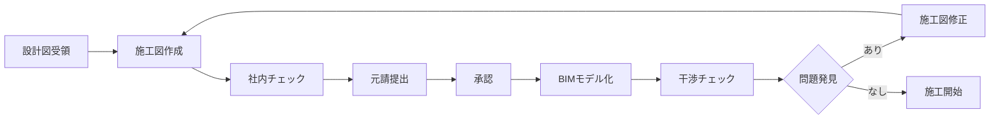

# 施工図の基礎

<div class="prerequisite-warning">
  <h3>⚠️ これがすべての基礎です</h3>
  <p>施工図を理解せずにBIMを使っても意味がありません。</p>
  <p>必ずこの章を完了してから、BIMの学習に進んでください。</p>
</div>

## 🎯 学習目標

この章を完了すると、以下ができるようになります：

- ✅ 施工図の役割と重要性を説明できる
- ✅ 主要な施工図用語を理解し使用できる
- ✅ 躯体図・仕上図・設備図の違いを説明できる
- ✅ 図面記号を読み取れる
- ✅ 平面図・断面図・矩計図を読める

## 📚 学習内容

### 1. [用語集（基礎）](terminology.md)
施工図を理解するための基本用語

- 躯体（くたい）
- 納まり（おさまり）
- 干渉（かんしょう）
- 通り芯（とおりしん）
- FL / GL
- 天端（てんば）
- 墨出し（すみだし）

### 2. [施工図の種類](types.md)
現場で使用される施工図の種類と用途

- 躯体図
- 配筋図
- 仕上図
- 建具図
- 設備図

### 3. [図面の読み方](reading.md)
施工図を正しく読み取る方法

- 平面図の読み方
- 断面図の読み方
- 矩計図の読み方
- 図面記号の意味

## 🏗️ 施工図とは

### 設計図との違い

```
設計図（意匠図）  →  何を作るか（デザイン）
     ↓
施工図           →  どう作るか（具体的な寸法・納まり）
```

### 施工図の役割

1. **具体化**: 設計図では不明確な部分を具体的にする
2. **調整**: 構造・設備・仕上を統合し納まりを検討
3. **指示**: 職人が施工できるレベルの詳細を記載
4. **確認**: 発注者・監理者の承認を得る

!!! info "BIMとの関係"
    施工図の情報をBIMモデルに反映します。  
    施工図が不正確だと、BIMモデルも不正確になります。

## 📊 施工図作成の流れ



## 💡 講師ノート

受講者に伝えるべき重要ポイント：

- 「施工図は日本の建設現場の言語」であることを強調
- 施工図なしでは職人は動けない
- 施工図の精度が現場の品質を決める
- BIMは施工図を作るツールではなく、チェックするツール
- 外国と日本の施工図の違いを説明する

## ❌ よくある誤解

### 誤解1: 設計図があれば施工できる
**× 間違い**: 設計図は概要であり、施工の詳細は不足している  
**○ 正しい**: 施工図で納まりや寸法を具体化する必要がある

### 誤解2: BIMがあれば施工図は不要
**× 間違い**: BIMは施工図の代わりではない  
**○ 正しい**: 施工図の情報をBIMで3D化し、チェックする

### 誤解3: CADが使えれば施工図が作れる
**× 間違い**: CADは道具に過ぎない  
**○ 正しい**: 建築・構造・設備の知識と経験が必要

## ✅ 理解度チェック

この章を学び終えたら、以下を確認してください：

- [ ] 施工図と設計図の違いを説明できる
- [ ] 施工図の役割を3つ以上言える
- [ ] 躯体図と仕上図の違いが分かる
- [ ] 通り芯、FL、GLの意味が分かる
- [ ] 平面図に書かれている情報が読み取れる

すべてチェックできたら、次の章「BIM概要」に進みましょう。

---

<div style="text-align: center; margin-top: 2rem;">
  <a href="terminology/" class="md-button md-button--primary">
    用語集から始める →
  </a>
</div>
