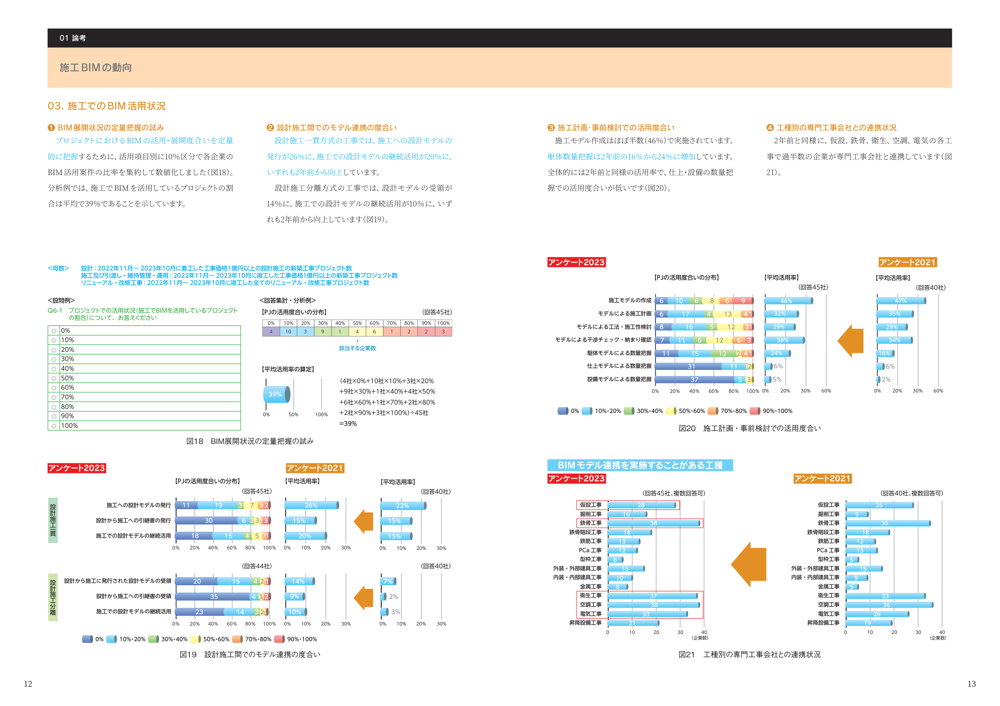
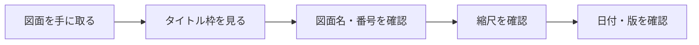

# 図面の読み方

施工図を正しく読むための基本を学びます。

!!! warning "施工図が読めないとBIMは使えません"
    BIMモデルは施工図の情報を3次元化したものです。まず施工図の読み方を習得しましょう。

## 📐 図面の基本構成

### 1. タイトル枠（表題欄）

<div class="step-box">

すべての図面には以下の情報が記載されています：

- **図面名**: 何の図面か（躯体図、配筋図、設備図など）
- **図面番号**: 管理用の番号（例: S-01, A-101）
- **縮尺**: 実際のサイズとの比率（1/50、1/100など）
- **図面日付**: 作成日・改訂日
- **作成者**: 誰が作ったか（会社名・担当者名）
- **承認欄**: 確認者のサイン

</div>

**まず最初にタイトル枠を確認**して、どの図面を見ているか把握しましょう。

---

### 2. 縮尺の理解

| 縮尺 | 意味 | 用途 |
|------|------|------|
| 1/100 | 実際の100分の1 | 全体配置図、平面図 |
| 1/50 | 実際の50分の1 | 詳細平面図、躯体図 |
| 1/30 | 実際の30分の1 | 配筋図、詳細図 |
| 1/10 | 実際の10分の1 | 接合部詳細 |
| 1/1 | 実物大 | 特殊な納まり |

!!! tip "縮尺の確認方法"
    図面にスケール（目盛り）が描かれていることが多いです。それを定規で測って確認できます。

---

### 3. 通り芯（グリッドライン）

<div class="image-wrapper">
  
  <p class="caption">図1: 通り芯の表記例（出典: 施工BIM資料①）</p>
</div>

**通り芯**は建物の基準となる線です：

- **縦方向**: 数字（1, 2, 3...）または X1, X2, X3...
- **横方向**: アルファベット（A, B, C...）または Y1, Y2, Y3...

**通り芯の交点**が柱の中心になることが多いです。

**例**: 「A通りと1通りの交点に柱」

---

## 📏 寸法の読み方

### 1. 寸法線の種類

```
←―――――――→  通し寸法（総寸法）
  ←―→←―→   個別寸法（部分寸法）
```

- **通し寸法**: 全体の長さ
- **個別寸法**: 各部分の長さ

!!! warning "注意"
    通し寸法と個別寸法の合計が一致することを確認しましょう。

---

### 2. 寸法の単位

- **日本**: ミリメートル（mm）が基本
  - 図面に「3000」とあれば **3000mm = 3m**
  - 小数点は使わない（例: 3500mm、150mm）

- **海外**: センチメートル（cm）やメートル（m）も使用
  - 単位記号の確認が重要

---

### 3. レベル（高さ）の読み方

<div class="step-box">

**レベル記号**: 高さを示すマーク

- **基準レベル**: 通常は1階床面を ±0（ゼロ）とする
- **プラス表記**: +3500 → 1階床面から3500mm上
- **マイナス表記**: -500 → 1階床面から500mm下

**例**:
- 2階床レベル: +3600（階高3600mm）
- 天井レベル: +2700（天井高2700mm）
- 基礎底レベル: -2000（1階床から2000mm下）

</div>

---

## 🔄 図面の見方（平面・断面・立面）

### 1. 平面図（Plan View）

<div class="image-wrapper">
  
  <p class="caption">図2: 平面図の見方（出典: 施工BIM資料①）</p>
</div>

**平面図**は建物を上から見た図です：

- 柱・梁・壁の位置
- 部屋の配置
- 通り芯と寸法

**読み方のコツ**:
1. 通り芯を探す
2. 柱の位置を確認
3. 梁の配置を確認
4. 寸法を確認

---

### 2. 断面図（Section View）

**断面図**は建物を垂直に切った図です：

- 高さ方向の構成
- 階高、天井高
- 梁のせい（高さ）、スラブ厚

**記号**: 断面位置は平面図に 「S-1」「A-A'」などの記号で示されます。

**読み方のコツ**:
1. どこで切った断面か確認
2. 各階のレベルを確認
3. 天井高を確認
4. 梁・スラブの寸法を確認

---

### 3. 立面図（Elevation View）

**立面図**は建物を横から見た図です：

- 外観の形状
- 窓・ドアの位置
- 外壁の仕上げ

---

## 🔍 記号の読み方

### 1. 構造部材の記号

| 記号 | 意味 | 英語 |
|------|------|------|
| C | 柱（Column） | Column |
| G | 大梁（Girder） | Girder |
| B | 梁（Beam） | Beam |
| S | スラブ（Slab） | Slab |
| W | 壁（Wall） | Wall |
| F | 基礎（Foundation） | Foundation |

**例**: C1 → 1番柱、G1 → 1番大梁

---

### 2. 鉄筋の記号

| 記号 | 意味 | 説明 |
|------|------|------|
| D | 異形鉄筋（Deformed bar） | D10, D13, D16... |
| φ | 丸鋼（Plain bar） | φ9, φ12... |
| @ | ピッチ（間隔） | @100 → 100mm間隔 |

**例**:
- D13@200 → 直径13mmの異形鉄筋を200mm間隔で配置
- 2-D16 → 直径16mmの異形鉄筋を2本

---

### 3. 材料の記号

| 記号 | 意味 |
|------|------|
| FC | 設計基準強度（コンクリート） |
| SD | 異形棒鋼 |
| SN | 建築構造用圧延鋼材 |

**例**: Fc24 → 設計基準強度24N/mm²のコンクリート

---

## 📋 図面を読む手順

### ステップ1: 図面の種類を確認


---

### ステップ2: 全体を把握

1. **通り芯を探す** → 建物の基準を理解
2. **寸法を確認** → 大きさを把握
3. **主要部材を確認** → 柱・梁・スラブの配置

---

### ステップ3: 詳細を確認

1. **寸法の確認** → 通し寸法と個別寸法の整合
2. **記号の確認** → 部材記号・鉄筋記号
3. **注釈の確認** → 特記事項・施工上の注意

---

### ステップ4: 関連図面と照合

<div class="step-box">

**複数の図面を見比べる**:

- 平面図 ⇔ 断面図 → 高さ方向の確認
- 躯体図 ⇔ 配筋図 → 鉄筋位置の確認
- 構造図 ⇔ 設備図 → 干渉の確認

</div>

---

## 💡 図面を読む時のコツ

### 1. 疑問点はメモする
わからない記号・寸法はメモしておき、後で調べる or 質問する。

### 2. 実物と照合する
現場で実際の部材を見ながら図面を確認すると理解が深まります。

### 3. 3つの図面を同時に見る
平面図・断面図・立面図を同時に見ることで立体的に理解できます。

### 4. BIMモデルと比較する
BIMモデルがあれば、図面と見比べることで理解が加速します。

---

## ❌ よくある間違い

### 間違い1: 縮尺を確認しない
**問題**: 図面に「3000」とあるのを「3000mm」ではなく「3m」と誤解。

**対策**: タイトル枠で縮尺と単位を必ず確認。

---

### 間違い2: 通し寸法と個別寸法が合わない
**問題**: 個別寸法を足しても通し寸法にならない。

**対策**: 計算して確認。合わない場合は図面ミスの可能性。

---

### 間違い3: レベルの基準が分からない
**問題**: +3000が何を基準にした高さか分からない。

**対策**: 1階床面が±0であることを確認。

---

## ❓ 小テスト

<div class="quiz" data-quiz-id="reading">

### Q1: 縮尺1/50の図面で、図面上10mmは実際の長さは？

- [ ] A. 10mm
- [ ] B. 100mm
- [x] C. 500mm
- [ ] D. 1000mm

**解説**: 縮尺1/50なので、図面上10mm × 50 = 500mm（実際の長さ）

### Q2: 「D13@200」の意味は？

- [ ] A. 直径13mmの鉄筋を20本配置
- [x] B. 直径13mmの鉄筋を200mm間隔で配置
- [ ] C. 直径200mmの鉄筋を13本配置
- [ ] D. 直径13mmの鉄筋を2本配置

**解説**: D13 = 直径13mm、@200 = 200mm間隔を意味します。

### Q3: レベル「+3600」の意味は？

- [ ] A. 3600階
- [ ] B. 3.6m下
- [x] C. 基準面から3600mm上
- [ ] D. 3600番の部材

**解説**: + は基準面（通常1階床面）より上を意味します。

### Q4: 通り芯「A通りと1通りの交点」に何があることが多い？

- [ ] A. 窓
- [x] B. 柱
- [ ] C. ドア
- [ ] D. 階段

**解説**: 通り芯の交点には柱が配置されることが多いです。

### Q5: 図面を読む時に最初に確認すべきは？

- [ ] A. 細かい寸法
- [x] B. タイトル枠（図面名・縮尺）
- [ ] C. 色
- [ ] D. 製作者の名前

**解説**: まずタイトル枠で図面の種類・縮尺を確認することが重要です。

</div>

## 🔗 関連ページ

- [施工図の基礎](index.md) - 施工図とは何か
- [施工図の種類](types.md) - 施工図の種類を学ぶ
- [施工図用語集](terminology.md) - 用語を学ぶ

---

<div style="text-align: center; margin-top: 2rem;">
  <p><strong>図面の読み方を理解したら、次は実際の図面で練習しましょう！</strong></p>
</div>
