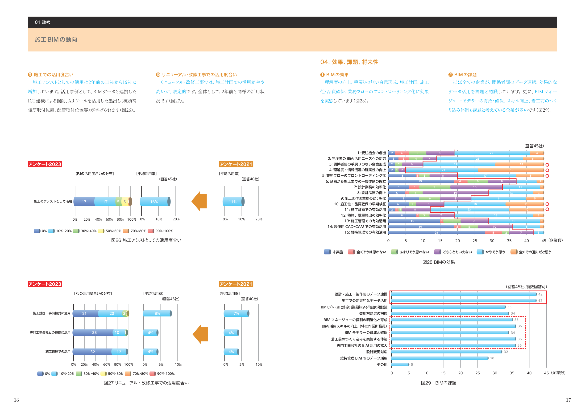
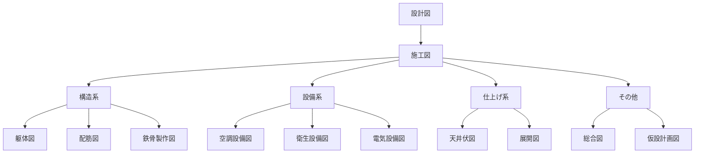

# 施工図の種類

施工図には様々な種類があります。それぞれの役割と使い分けを学びましょう。

!!! tip "施工図の体系"
    設計図 → 施工図 → 製作図・加工図 の順に詳細化されます。

## 📐 施工図の分類

### A. 構造系施工図（躯体工事）

#### 1. 躯体図 🔴

**目的**: 柱・梁・スラブなど構造体の位置・寸法を示す

**記載内容**:
- 柱・梁・壁の位置と寸法
- スラブ厚さ
- 開口部（窓・ドア）の位置
- 通り芯と寸法

**使う人**:
- 元請（施工管理）
- 型枠工事会社
- 鉄筋工事会社

**関連BIM活用**: [躯体図チェック](../bim/recipes/structure-check.md)

  
  
図1: 躯体図の例（出典: 施工BIM資料①）

---

#### 2. 配筋図 🔴

**目的**: 鉄筋の配置・径・間隔を詳細に示す

**記載内容**:
- 主筋の位置・本数・径（例: D13、D16）
- スターラップ・帯筋の間隔（例: @100、@200）
- かぶり厚さ
- 継手位置・定着長さ

**使う人**:
- 鉄筋工事会社
- 鉄筋加工場

**関連BIM活用**: [鉄筋納まりチェック](../bim/recipes/rebar-coordination.md)

**例**: 柱配筋図、梁配筋図、スラブ配筋図

---

#### 3. 鉄骨製作図 🟡

**目的**: 鉄骨部材の詳細寸法・接合部を示す

**記載内容**:
- 部材寸法（長さ・幅・厚さ）
- ボルト穴位置・径
- 溶接記号
- 部材番号（管理用）

**使う人**:
- 鉄骨製作工場
- 鉄骨建方会社

**関連BIM活用**: [鉄骨二次部材チェック](../bim/recipes/steel-secondary.md)

---

### B. 設備系施工図

#### 4. 空調設備図 🟡

**目的**: 空調機器・ダクトの配置とルートを示す

**記載内容**:
- 空調機器の位置・型番
- ダクトのサイズ・ルート
- 吹出口・吸込口の位置
- 制御盤の位置

**使う人**:
- 空調設備工事会社
- ダクト製作会社

**関連BIM活用**: [設備配管ルート検討](../bim/recipes/mep-routing.md)

---

#### 5. 衛生設備図 🟡

**目的**: 給排水配管のルートと機器配置を示す

**記載内容**:
- 給水・排水配管のルート
- 配管径・勾配
- 衛生器具（便器・洗面器など）の位置
- ポンプ・タンクの位置

**使う人**:
- 衛生設備工事会社
- 配管工事会社

**関連BIM活用**: [設備配管ルート検討](../bim/recipes/mep-routing.md)

---

#### 6. 電気設備図 🟡

**目的**: 電気配線・機器の配置を示す

**記載内容**:
- 配電盤・分電盤の位置
- 照明器具の位置・種類
- コンセント・スイッチの位置
- 配線ルート（ケーブルラック）

**使う人**:
- 電気工事会社

---

### C. 仕上げ系施工図

#### 7. 天井伏図 🟡

**目的**: 天井の仕上げと設備機器の配置を示す（下から見上げた図）

**記載内容**:
- 天井材の種類・割付
- 照明器具の位置
- 空調吹出口・吸込口
- スプリンクラーヘッド
- 点検口の位置

**使う人**:
- 内装工事会社
- 電気工事会社
- 設備工事会社

  
  
図2: 天井伏図と設備配置（出典: 施工BIM④）

---

#### 8. 展開図 🟢

**目的**: 壁面を正面から見た図（室内の各壁面）

**記載内容**:
- 壁仕上げの種類・範囲
- 窓・ドアの位置と高さ
- スイッチ・コンセントの位置と高さ
- 家具・設備機器の位置

**使う人**:
- 内装工事会社
- 家具工事会社

---

### D. その他の施工図

#### 9. 総合図 🔴

**目的**: 躯体・設備・仕上げを統合した図（干渉確認用）

**記載内容**:
- 躯体（梁・スラブ）
- 設備（ダクト・配管）
- 天井高さ
- 干渉箇所

**使う人**:
- 元請（施工管理）
- 各専門工事会社

**特徴**: BIMで作成することが増えている

!!! tip "総合図 = BIMの得意分野"
    総合図の作成は手作業では非常に時間がかかりますが、BIMなら自動的に作成できます。

---

#### 10. 仮設計画図 🟡

**目的**: 工事用の仮設設備の配置を示す

**記載内容**:
- 足場の範囲・高さ
- タワークレーンの位置・作業半径
- 仮設事務所・倉庫の配置
- 資材置き場
- 作業動線

**使う人**:
- 元請（施工管理・安全管理）
- 仮設専門会社

**関連BIM活用**: [仮設計画検討](../bim/recipes/temp-planning.md)

---

## 📊 施工図の体系図

---

## 🔄 図面の詳細化の流れ

### 1. 設計図（Design Drawing）
建築士が作成。意匠・構造・設備の基本を示す。

↓

### 2. 施工図（Shop Drawing）
ゼネコンが作成。実際の施工のための詳細図。

↓

### 3. 製作図・加工図（Fabrication Drawing）
専門工事会社が作成。部材製作のための超詳細図。

**例**:
- 鉄筋加工図（鉄筋1本1本の曲げ寸法）
- 鉄骨製作図（ボルト穴の位置まで記載）
- ダクト製作図（板金展開図）

---

## 💡 施工図の使い分け

### 工程別の主要図面

| 工程 | 主要図面 | 確認内容 |
|------|---------|---------|
| 基礎工事 | 躯体図、配筋図 | 基礎の位置・寸法・配筋 |
| 躯体工事 | 躯体図、配筋図 | 柱・梁・スラブの寸法・配筋 |
| 鉄骨工事 | 鉄骨製作図 | 部材寸法・接合部 |
| 設備工事 | 設備図、総合図 | 配管・ダクトルート、干渉 |
| 仕上げ工事 | 天井伏図、展開図 | 仕上げ材・機器配置 |

---

### 立場別の使用図面

| 立場 | よく見る図面 |
|------|------------|
| 施工管理（元請） | すべての図面（特に総合図） |
| 鉄筋工事会社 | 配筋図、躯体図 |
| 型枠工事会社 | 躯体図 |
| 設備工事会社 | 設備図、総合図 |
| 内装工事会社 | 天井伏図、展開図 |

---

## ❌ よくある間違い

### 間違い1: 設計図と施工図を混同
**問題**: 設計図だけで施工しようとする。

**対策**: 施工図は設計図より詳細。必ず施工図を確認。

---

### 間違い2: 古い版の図面を使用
**問題**: 改訂された図面があるのに古い版で施工。

**対策**: 図面の版番号・日付を確認。最新版を使う。

---

### 間違い3: 関連図面を見ない
**問題**: 躯体図だけ見て、設備図を見ずに施工。

**対策**: 関連する図面（躯体+設備+仕上げ）をセットで確認。

---

## ❓ 小テスト

### Q1: 鉄筋の配置・径・間隔を示す図面は？

- [ ] A. 躯体図
- [x] B. 配筋図
- [ ] C. 設備図
- [ ] D. 天井伏図

**解説**: 配筋図は鉄筋の詳細を示す図面です。

### Q2: 天井を下から見上げた図面は？

- [ ] A. 平面図
- [ ] B. 断面図
- [x] C. 天井伏図
- [ ] D. 立面図

**解説**: 天井伏図は天井を下から見上げた図で、照明や空調の配置を示します。

### Q3: BIMが最も得意とする図面は？

- [ ] A. 配筋図
- [x] B. 総合図
- [ ] C. 展開図
- [ ] D. 製作図

**解説**: 総合図は躯体・設備・仕上げを統合するため、BIMが最も力を発揮します。

### Q4: 施工図の詳細化の流れで正しいのは？

- [x] A. 設計図 → 施工図 → 製作図
- [ ] B. 施工図 → 設計図 → 製作図
- [ ] C. 製作図 → 施工図 → 設計図
- [ ] D. すべて同時に作成

**解説**: 設計図を元に施工図を作成し、さらに製作図を作成します。

### Q5: 仮設計画図に記載されるものは？

- [ ] A. 鉄筋の配置
- [ ] B. 配管ルート
- [x] C. タワークレーンの位置
- [ ] D. 内装仕上げ

**解説**: 仮設計画図には足場、クレーン、仮設事務所などの配置を示します。

## 🔗 関連ページ

- [施工図の基礎](index.md) - 施工図とは何か
- [図面の読み方](reading.md) - 図面の読み方を学ぶ
- [施工図用語集](terminology.md) - 用語を学ぶ
- [BIM活用レシピ](../bim/recipes/index.md) - BIMで施工図を活用

---

  
<strong>施工図の種類を理解したら、次は実際の図面で確認しましょう！</strong>

